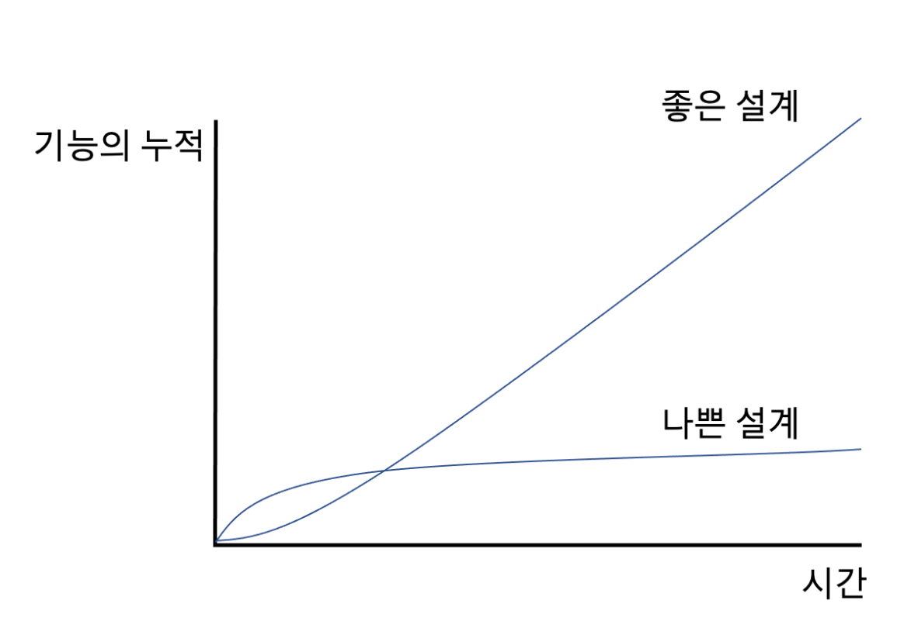

# 리팩토링 2장

# 리팩터링 원칙

> 리팩터링 책 2장에 대해 정리
> 

## 리팩터링 정의

---

> 
- 리팩터링: [명사] 소프트웨어의 겉보기 동작은 그대로 유지한 채, 코드를 이해하고 수정하기 쉽도록 내부 구조를 변경하는 기법  
- 리팩터링(하다): [동사] 소프트웨어의 겉보기 동작은 그대로 유지한채, 여러 가지 리팩터링 기법을 적용해서 소프트웨어를 재구성하다.

*누군가 "리팩터링 하다가 코드가 깨져서 며칠이나 고생했다" 라고 한다면, 십중팔구 리팩터링한 것이 아니다.*

> 
- 동작을 보존하는 작은 단계들을 거쳐 코드를 수정하고, 이러한 단계들을 순차적으로 연결하여 큰 변화를 만들어 내는 일
- 리팩터링 하는 동안에는 코드가 항상 정상 동작하기 때문에 리팩터링 작업이 끝나지 않았더라도 언제든 멈출 수 있다.
- 기능을 추가하지 않는 한 사용자 관점에서는 달라지는 점이 없어야 한다.

## 두개의 모자

---

> 켄트 백은 *'기능 추가'*, 아니면 *'리팩터링'*을 구분해 두 개의 모자에 비유했다.

- 한번에 한 가지만 할 것을 강조
    - ‘기능 추가’ 모자를 쓴 다음에는 기존 코드를 절대 건드리지 않고 기능 추가에만 집중
    - ‘리팩터링’ 모자를 쓴다면 기능 추가는 절대로 하지 않고 오로지 코드 재구성에만 집중

## 리팩터링하는 이유

---

> *리팩터링이 소프트웨어의 모든 문제점을 해결하는 만병통치약은 절대 아니다. 하지만 코드를 건강한 상태로 유지하는 데 도와주는 약임은 분명하다.*

- 소프트웨어 설계가 좋아진다.
    - 코드 설계 파악이 어려워질수록 설계를 유지하기 힘들고 설계가 부패되는 속도는 빨라진다.
    - 같은 일을 하더라도 설계가 나쁘면 코드가 길어지고, 사실상 같은 일을 하는 코드가 여러곳에 나타날 수 있다.
        - 낮은 응집도
    - 코드가 길면 이해해야 할 코드량이 늘고 비슷한 코드가 산재해 있다면 한 부분만 살짝 바꿔서는 시스템이 예상대로 작동하지 않을 수 있다.
    - 중복코드의 제거는 언제나 고유한 일을 수행함을 보장하기 때문에 바람직한 설계의 핵심이다.
- 소프트웨어를 이해하기 쉬워진다.
    - 미래의 나 자신을 위해 코드를 깔끔하게 유지하는게 좋다.
    - 기억 용량의 초과
        
> 
*"코드를 보면 알 수 있는 것들은 의도적으로 기억하지 않는다".  
"기억 용량을 초과할까봐 그래서 기억 할 필요가 있는 것들은 최대한 코드에 담으려고 한다"*

- 버그를 쉽게 찾을 수 있다.
  - 프로그램의 구조를 명확하게 다듬으면 그냥 ‘이럴 것이다’라고 가정하던 점들이 분명하게 드러나고 버그를 지나치려야 지나칠 수 없을 정도까지 명확해 진다.
  - 켄트 백의 말
    - “난 뛰어난 프로그래머가 아니에요. 단지 뛰어난 습관을 지닌 괜찮은 프로그래머일 뿐이에요”
      - 습관적으로 리팩터링을 한다고 말 하는 것 같다.

- 프로그래밍 속도를 높일 수 있다.
    - 리팩터링을 하면 품질을 높일 수 있다는 점에는 대부분 쉽게 수긍하지만,리팩터링하는데에 시간이 드니 전체 개발 속도는 떨어질까봐 걱정한다.
    - 리팩터링 하지 않고 기능 추가에만 집중하다 보면 초기에는 진척이 빠르지만 나중에 가서는 새 기능을 기존 코드베이스에 잘 녹여낼 방법을 찾는 데 드는 시간이 늘어난다는 것이다.
    
    
    *[<지구력 가설>](https://martinfowler.com/bliki/DesignStaminaHypothesis.html)*
    

## 언제 리팩터링해야 할까?

---

> *한 시간 간격으로 리팩터링 한다.*
> 

> ***3의 법칙***

*돈 로버츠(Don Roberts)가 내게 제시한 가이드다*.

1. 처음에는 그냥 한다.
2. 비슷한 일을 두 번째로 하게 되면 일단 계속 진행한다.
3. 비슷한 일을 세 번째 하게 되면 리팩터링 한다.*

- 리팩터링 2판 2장 2.4절.
> 
- 준비를 위한 리팩터링: 기능을 쉽게 추가하게 만들기
    - 리팩터링 하기 가장 좋은 시점은 기능 추가 하는 순간
        - 이 시점에 현재 코드를 살펴보면서, 구조를 살짝 바꾸면 다른 작업을 하기가 훨씩 쉬워질 만한 부분을 찾는다.
        - 기존 함수를 복제하여 리팩터링 해야할 일이 있으면 **함수 매개변수화하기** 를 적용해보자
    - 버그를 잡을때에도 리팩터링 하기 좋은 시점
        - 만약 오류를 발생시키는 코드가 세 곳에 복제되어 퍼져 있다면, 우선 한곳으로 합치는 것이 작업하기 수월하다.
        - 질의 코드에 섞여있는 갱신 로직을 분리하면 두 작업이 꼬여서 생기는 오류를 줄일 수 있다.
- 이해를 위한 리팩터링: 코드를 이해하기 쉽게 만들기
- 쓰레기 줍기 리팩터링
- 계획된 리팩터링과 수시로 하는 리팩터링
- 오래 걸리는 리팩터링
- 코드 리뷰에 리팩터링 활용하기
- 관리자에게는 뭐라고 말해야 할까?
- 리팩터링 하지 말아야 할때

## 리팩터링 시 고려할 문제

---

- 새 기능 개발 속도 저하
    - 많은 새람들이 리팩터링 때문에 새 기능 개발 속도가 저하된다고 믿고 있다.
    
    > *하지만 리팩터링의 궁극적인 목적은 개발 속도를 높여서, 더 적은 노력으로 더 많은 가치를 창출하기 위함이다.*
    > 
    - 주변 동료들의 얘기로는 리팩터링을 과도하게 하는 경우보다 거의 하지 않는 경우가 많다.
    - 건강한 코드의 위력을 경험해 보지 않고서는 코드베이스가 건강할 때와 허약할 때의 생산성 차이를 체감하기 어렵다.
        - 그러므로 리팩터링을 더 자주, 열심히 해야 한다.
    - 오로지 경제적인 이유에서 리팩터링을 한다.
        - **리팩터링을 클린코드, 바람직한 엔지니어링 습관 처럼 도덕적인 이유로 정당화 해선 안된다.**
        - 본질은 생성상의 증대, 개발 기간과 버그 수정 시간을 단축하는 데에 있다.
- 코드 소유권
    - 리팩터링 하려고 하는 메서드의 소유권이 다른 팀에 있는 경우에는 어떻게 해야할까?
    - 코드 소유권이 나뉘어져 있으면 리팩터링에 방해가 된다.
        - 코드 소유권을 작은 단위로 나누어 관리하는것에 반대한다.
        - **그것 보다, 코드 소유권을 팀 전체로 두어 팀원이라면 누구나 팀이 소유한 코드를 수정할 수 있게끔 한다.**
        - **각자가 책임지는 영역이 있을 수 있다. 이것이 다른 사람이 코드를 수정하게 둬서는 안된다라는 말이 아니라 책임지는 영역의 변경사항을 관리하라는 의미이다.**
            - 이를 위해 코드의 브랜치를 새로 생성하고 새 브랜치에서 수정한 뒤 기존 브랜치로 pull request 하는 방식의 모델을 권장하기도 한다(오픈 소스 개발 모델)
- 브랜치
    - 통합을 하지 않은채 독립 브랜치에서 계속 작업하다 보면 작업 결과를 마스터 브랜치로 통합하기가 매우 힘들어진다.
        - 심지어는 기능 개발의 기간보다 통합하는 기간이 훨씬 더 길어지기도 한다.
    - 지속적 통합(CI)과 트렁크 기반 개발(TBD)
        - 독립(기능) 브랜치를 마스터 브랜치로 자주 주기적으로 통합한다.
        - 충돌이 발생하는 지점을 자주 볼 수 있기 때문에 리팩터링과 궁합이 잘 맞는다.
        - 켄트 백은 CI와 리팩터링을 합쳐서 XP(eXtreme Programming)이라고 하였다.
    - **통합 주기를 짧게 가져야 한다.**
- 테스팅
    - 리팩터링을 시도하는 중에도 프로그램의 동작은 똑같이 유지되야 한다.
        - 도중에 실수하게되면 동작은 깨질 것이다.
    - 테스트 스위트(Test Suite)는 리팩터링을 시도하였을때 실수한 부분을 빠르게 확인할 수 있게 도와준다.
        - 그래서 리팩터링을 하기 위해서는 [자가 테스트 코드](https://martinfowler.com/bliki/SelfTestingCode.html)를 마련하는 것이 좋다.
            - 새 기능 추가를 안전하게 할 수 있는데, 실수로 만든 버그를 빠르게 제거 할 수 있기 때문이다.
            - 자신있게 리팩터링이 가능하다(리팩터링 후 → 테스트 코드 실행 → 테스트 실패 → 테스트 성공하게끔 코드 변경 → ….. 반복)
        - 만약 자동 리팩터링 기능 제공하는 환경(IDE)이 있다면 굳이 테스트 하지 않아도 오류가 생기지 않는다고 확신할 수 있다.
- 레거시 코드
    - 안타깝지만 테스트가 제대로 갖추어져 있지 않을 수 있다.
        - 테스트가 갖춰져 있다고 해서 레거시 코드를 단번에 리팩터링 하기란 어렵다.
    - 캠핑 규칙을 생각하자.
        - 처음 왔을때 보다 깨끗하게 치우는 것이다.
        - 코드의 한 부분을 훑고 넘어갈 때마다 예전보다 조금이라도 개선하려고 노력한다.
    - 자주 보는 부분을 더 많이 리팩터링 한다.
        - 자주 보는 부분을 이해하기 쉽게 개선한다면 그 만큼 시간도 절약 될 것이다.

## 리팩터링, 아키텍쳐, 애그니(YAGNI)

---

- 미래를 생각한 유연성 매커니즘
    - 잘못 구현한 유연성 매커니즘
        - 요구사항이 예상과 다르게 바뀌는 경우
        - 설계 결함
        - 당장의 쓰임에 비해 복잡한 함수
    - 변화에 대응하는 능력이 떨어질 수도 있다.
- 유연성 매커니즘 보다는 리팩터링
    - 그저 현재까지 파악한 요구사항을 **충분히 멋지게** 해결하는 소프트웨어를 만든다.
- 간결한 설계, 점진적 설계, YAGNI(You Aren’t Going To Need It - 필요 없을 거다)
    - 나중에 문제를 깊이 이해 했을때 처리하는 쪽이 훨씬 낫다.
    - 선제적인 처리를 배척한다는 말이 아니다.

## 리팩터링과 소프트웨어 개발 프로세스

---

- 3가지 기법(XP의 특징)
    - 리팩터링
    - 테스트 코드
        - 테스트 코드는 굉장히 중요하다.
        - 팀으로 개발하면서 리팩터링을 하려면 다른 사람의 작업을 방해 하지 않으면서 언제든지 리팩터링 할 수 있어야 한다. 이는 지속적 통합을 권장하는 이유이기도 하다.
        - 리팩터링한 결과가 테스트 코드를 통해서 빠르게 동료와 공유 할 수 있기 때문이다.
    - 지속적 통합
- 3가지 기법을 토대로 한 YAGNI
    - 위 3가지 기법과 YAGNI는 서로 긍정적인 영향을 끼친다. 3가지 기법이 YAGNI의 토대인 동시에 YAGNI로 인해 리팩터링을 더욱 쉽게 할 수 있기 때문이다.
    - **유연성 매커니즘을 많이 갖는 시스템보다 YAGNI를 준수한 시스템이 단순하기 때문에 훨씬 변경하기가 쉽다.**
    - 3가지 기법과 YAGNI를 이용하면 요구사항 변화에 빠르게 대응하고 안정적인 선순환 구조를 코드베이스에 심을 수 있다.

## 리팩터링과 성능

---

- 성능 VS 직관적인 설계
    
    > *필자는 실제로 소프트웨어를 이해하기 쉽게 만들기 위해 속도가 느려지는 방향으로 수정하는 경우도 많다고 한다.*
    > 
- 리팩터링 하면 소프트웨어가 느려질 수도 있는 건 사실이다. 하지만 리팩터링을 하면 성능 튜닝 하기에는 쉬워진다.
    - (*코드베이스가 건강하고 설계가 직관적이기 때문일 것 같다)*
- 대부분 프로그램은 전체 코드 중 극히 일부에서 대부분의 시간을 소비한다. 즉 코드베이스 일부분에서 성능 이슈가 발생하는 것이다.
    - 때문에 전체 코드를 고르게 최적화 한다고 하여도 효과는 미비하기 때문에 시간 낭비인 셈이다.
- **어차피 시간 낭비이기 때문에 성능에 대해서는 신경 쓰지않고 코드를 다루기 쉽게 만드는 것에 집중한다.**
    - 성능 최적화 단계에 돌입하기 전까지 지속적으로 코드를 다루기 쉽게 만드는 것에 집중한다.
    - 성능 최적화 단계에 돌입하면 리팩터링할 때처럼 최적화를 위한 수정도 작은 단계로 나눠서 진행한다.
        - 성능 개선에 실패하면 되돌아 가고 성공하면 커밋한다.
    - **이렇게 할 수 있는 이유는 평소에 코드를 다루기 쉽게 만드는 것에 집중했기 때문이고, 두 가지 이점이 생긴다.**
        - 첫번째 성능 튜닝 시간을 벌 수 있다. 리팩터링이 잘 되어 있기 때문에 기능 추가가 빨리 끝나서 성능에 집중할 시간을 번 것 이다.
        - 두번째 성능을 더 세밀하게 분석할 수 있다. 이 역시 리팩터링이 잘 되어 있기 때문에 프로파일 도구가 지적해주는 코드의 범위가 좁아 진다. 따라서 튜닝하기가 쉬워진다.
- 결국 리팩터링은 성능 좋은 프로그램을 만드는데 기여한다. 단기적으로 보면 성능이 느려질 수는 있으나 건강한 코드베이스를 유지하는 데에 노력하였기 때문에 중요한 일(성능 최적화)을 할때에 힘을 낼 수 있는 것이다.

## 리팩터링의 유래

---

## 리팩터링 자동화

---

# 더 읽어보면 좋을 것 들

---

- Building Evolutionary Architectures
- 클린 아키텍처